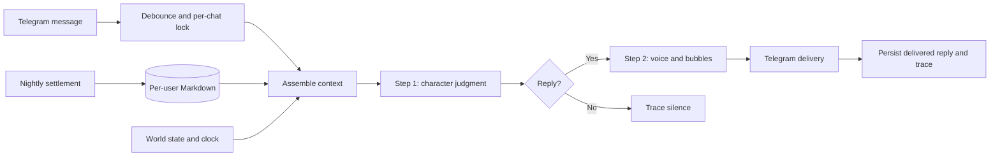

# Wren

**An AI character with a life outside the chat.**

Wren is an English-language relationship simulation delivered through Telegram. It explores a product question: can an AI character sustain a distinct personality, remember shared history, and disagree with a user without becoming a generic assistant?

The experience begins with a message request accepted by a fictional Brooklyn art-school character. Familiarity develops across conversations and days; affection is not the default response. Wren is explicitly disclosed as AI, the onboarding is marked 18+, and the product's content ceiling is suggestive rather than explicit.

**Status:** implemented prototype with Telegram transport, memory, daily world state, proactive scheduling, nightly relationship updates, evaluation tooling, and an operations viewer. The deeper vulnerability/recovery arc remains partial. This repository demonstrates the implementation and its tests; it does not establish retention, revenue, or a current production service.

[Product brief](PRD_product.md) · [Architecture](ARCHITECTURE.md) · [Evaluation design](EVAL_spec.md) · [Operations runbook](docs/RUNBOOK.md)

## The product decisions

| Decision | Why it matters | Implementation |
| --- | --- | --- |
| Decide before speaking | Character judgment should survive the pressure to please the user. | A first model call forms a private character state and reply decision; a second renders the result into short message bubbles. |
| Remember events, not just a transcript | A relationship needs continuity beyond the most recent prompt. | Per-user event memory, impressions, qualitative relationship state, and nightly settlement. |
| Give the character a day of her own | Time and events should affect a conversation. | Shared world state, an injectable clock, scheduled proactive turns, and activity/budget gates. |
| Keep progression qualitative | A points counter would turn a relationship into an optimization game. | Discrete access levels plus prose and freeze state; no accumulated affection score. |
| Evaluate experience separately from mechanics | Valid JSON does not prove that a character feels specific or consistent. | Offline contract tests, voice checks, multi-turn scenarios, and a separate model-judged “aliveness” rubric. |

These are design hypotheses encoded in a working system. Their effect on the user experience still needs independent evaluation.

## How it works



The core depends on a small `ChatModel` interface. A deterministic fake and an OpenAI-compatible adapter share that contract, allowing storage, scheduling, failure handling, and transport behavior to be exercised without API credentials. Evaluation code is separate from the production turn pipeline.

## Review the engineering

| Area | Code and tests worth opening |
| --- | --- |
| Two-stage orchestration and delivery failures | [`pipeline.py`](src/wren/core/pipeline.py), [`test_pipeline_trace.py`](tests/test_pipeline_trace.py), [`test_bot_handlers.py`](tests/test_bot_handlers.py) |
| User isolation, deletion, and atomic storage | [`storage.py`](src/wren/core/storage.py), [`atomicio.py`](src/wren/core/atomicio.py), [`test_isolation.py`](tests/test_isolation.py) |
| Background jobs sharing the live-turn lock | [`scheduler.py`](src/wren/bot/scheduler.py), [`test_settle_concurrency.py`](tests/test_settle_concurrency.py), [`test_proactive_scheduler.py`](tests/test_proactive_scheduler.py) |
| Model substitution and offline testing | [`model/`](src/wren/model/), [`test_model_registry.py`](tests/test_model_registry.py), [`conftest.py`](tests/conftest.py) |
| Experience evaluation | [`eval/`](src/wren/eval/), [`eval/corpus/`](eval/corpus/), [`EVAL_spec.md`](EVAL_spec.md) |
| Operational visibility and recovery | [`ops/`](src/wren/ops/), [`test_web.py`](tests/test_web.py), [`test_backup_encryption.py`](tests/test_backup_encryption.py), [`test_restore_safety.py`](tests/test_restore_safety.py) |

Generated output and delivered output are treated separately: Telegram handlers persist the visible reply only after sending succeeds. Per-user traces retain stage and failure information for diagnosis. Metrics use salted identifiers; the local operations viewer has a token-authentication gate and can inspect sensitive traces, so it is an operator tool.

## Run the offline checks

Requires Python 3.11+ and [uv](https://github.com/astral-sh/uv). Dependency installation needs network access; the following test run uses fake models and mocked Telegram transport.

```bash
git clone https://github.com/Leonxu6/Wren.git
cd Wren
uv sync --locked

WREN_FAKE_MODEL=1 uv run pytest -q
uv run ruff check .
uv run mypy src
```

No `.env`, bot token, or model API key is needed for these checks. Tests isolate user and world data in temporary directories. A focused starting point is:

```bash
WREN_FAKE_MODEL=1 uv run pytest -q \
  tests/test_pipeline_trace.py tests/test_isolation.py \
  tests/test_proactive_scheduler.py tests/test_settle_concurrency.py
```

Passing fake-model tests demonstrates software behavior, not dialogue quality.

## Run a connected bot or evaluation

Copy `.env.example` to `.env` and configure a compatible model endpoint, `WREN_API_KEY`, and `TELEGRAM_BOT_TOKEN`. Review the [runbook](docs/RUNBOOK.md) before exposing a bot: owner-only debug commands, rate limits, model-call budgets, metrics salt, viewer authentication, and backup handling are deployment concerns.

```bash
uv run wren-bot

# Separate, paid model-evaluation runs:
uv run wren-harness --quick --reps 2 --no-bakeoff
uv run wren-multiturn --quick
uv run wren-aliveness --quick
```

These commands contact external services. The example model names are repository configuration choices, not a guarantee of current provider availability. `/delete` removes the user's local conversation state; live data and credentials should never be committed.

## What is still open

- **Experience quality:** fake-model tests cannot validate voice, emotional consistency, or long-term relationship quality. The [historical Phase 0 report](docs/p0_verdict.md) explicitly invalidates its earlier full evaluation matrix after prompt changes; it is not a current benchmark.
- **Memory quality:** indirect recall remains a documented weak point of the cheaper model configuration. Retrieval scaffolding working does not mean the model reliably makes the right association.
- **Narrative depth:** level-gated vulnerability exists, but Phase 7 has no dedicated breakdown/recovery engine.
- **Deployment scale:** the Markdown store and in-process locks target a single application instance. Horizontal scaling requires a different concurrency/storage boundary.
- **Product validation:** audience size and subscription ideas in the product brief are targets, not achieved results.

## Stack and attribution

Python · python-telegram-bot · OpenAI Python SDK / compatible model APIs · Flask · DuckDB · pytest · Ruff · mypy

Wren's application logic, character design, prompts, evaluation corpus, and operating workflow live in this repository. Telegram transport is provided by [python-telegram-bot](https://github.com/python-telegram-bot/python-telegram-bot); model inference is supplied by the configured external provider. The project does not train its own foundation model.

## 中文概述

Wren 是一个通过 Telegram 交互的英文 AI 角色与关系模拟项目。产品关注的是：怎样让角色拥有稳定的性格、自己的生活、跨天记忆，以及拒绝和表达不同意见的能力。

实现覆盖了「先判断、再表达」的双阶段模型调用、按用户隔离的 Markdown 记忆、世界状态、主动消息、夜间关系更新、离线测试和运维工具。仓库同时保留产品取舍与评测边界：离线测试通过不等于角色体验优秀，历史评测不等于当前效果，商业目标也不等于已经取得的用户或营收成果。
