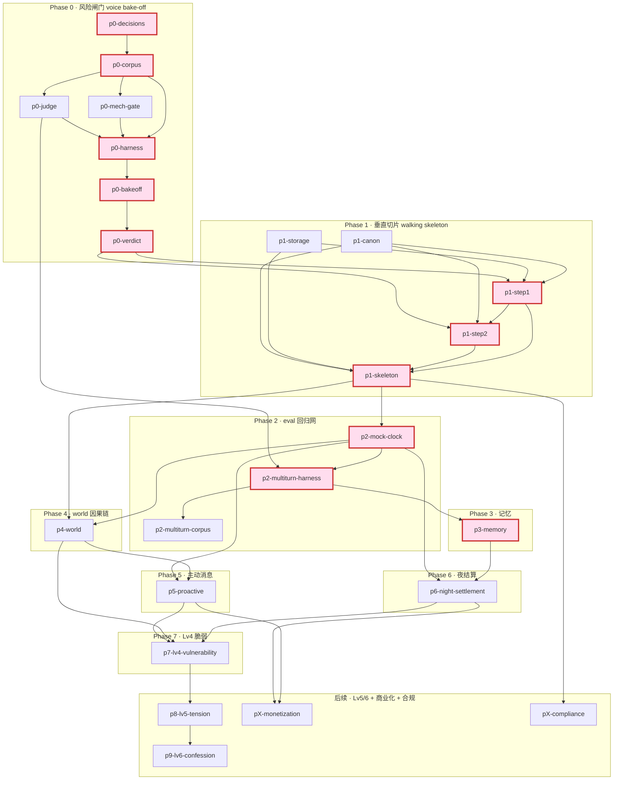

# Wren — 开发计划 (todo)

> **状态**:🟡 待 Leon 审阅(scaffold 已就位,**Phase 0 尚未开工** —— 等你过完计划再开)。
> **来源**:`tech-lead` agent 依 `ARCHITECTURE.md §12`(决策 15,风险优先)+ `EVAL_spec.md` 拆解,2026-05-20。
> **怎么用**:每个 `- [ ]` issue = 一个 git worktree + 同名分支(命名 `p<phase>-<slug>`),见 `docs/DEV_WORKFLOW.md`。互不依赖的 issue 可并行外包给不同会话/agent。
> **红线优先序**:PRD §3 六条魂 > ARCHITECTURE §0 两铁律 > ARCHITECTURE 决策 > PRD 正文(§15 仍是开放提案)。
> **标注**:⚠️**Leon 决策** = 依赖 PRD §15 / §13 carry-over,不替你拍板;🔒**契约** = 跨 issue 的 I/O 边界,需先定形;🧪**eval** = 验收靠 eval 通过率而非单测。

---

## 1. 里程碑总览(每阶段完成 = 谁能亲自体验到什么「卧槽」)

| Phase | 名字 | 完成 = 能亲自体验到什么 |
|---|---|---|
| **0** | 风险闸门 · voice bake-off | **Leon 亲眼看到**:某模型(DeepSeek-V3 或更强)在单轮里产出真正像 Wren 的 dry voice + 会拒绝 + 不伺候;拿到一张 bake-off 计分表,**敢说「主模型就用它」**——项目第一大不确定性被证实/证伪。 |
| **1** | 垂直切片 · 第一轮真对话 | **Leon 在自己手机的 Telegram 里** `/start`,看到相遇背景文案 + 她的沉默,打一句话,几秒后她以多条短气泡回你——一条真消息走通真链路。 |
| **2** | eval 接上 · 回归网 | **Leon 跑一条命令**,几分钟模拟一个玩家聊一周(mock 时钟快进),拿到「弧光断言 + 四维」通过率报告——之后每改一次 prompt 都有网兜底。 |
| **3** | 记忆 · 「她记住你」 | **Leon Day0 随口提一件事,Day2 她主动捞出来**——被看见的第一个卧槽(D2)。 |
| **4** | world / 因果链 · 「她有自己的生活」 | **早 8 点发消息她冷淡,凌晨发她状态全变**——她的心情有来处,不是凭空应答(D1 发动机)。 |
| **5** | 主动消息 · 「她半夜找你」 | **Leon 没发任何消息,半夜收到她一条** "you up?" / "today the studio was a write-off"——被一个真实的人想起。 |
| **6** | 关系夜结算 · 关系会长 | 连聊几天后**语气和解锁悄悄变了**;搞砸了会**退回去**——关系第一次像在「长」。 |
| **7** | Lv4 深夜脆弱 · 第一次「哭」 | 高关系 + 凌晨,**她第一次崩**;安慰套话让她关门,陪伴式让她留下——重量(D4)顶点。 |
| **后续** | Lv5/6 + 商业化 + 合规 | 暧昧/表白弧光、付费墙、18+/删数据收尾——可上线 v1。**多数为占位,依赖 Leon 决策。** |

---

## 2. 风险燃尽排序的 Issue 序列

> 排序 = 不确定性从高到低,最该先打的是最难/最新的(Phase 0),不是最容易的。Phase 0 拆到最细;Phase 1–2 中等;Phase 3+ 粗粒度占位。

### Phase 0 — 风险闸门:voice bake-off(最高风险,最先打)

> 整个 Phase = 单轮 eval harness + 跑料 + 出计分表。**无跑起来的系统**(无记忆/无关系演化/无多天)——只测「一个模型能不能在一轮里产出 Wren voice + 自主 + 反谄媚 + 具体感」。这正是 §15#4。
> Phase 0 内部小关键路径:`p0-decisions → p0-corpus →(p0-mech-gate ∥ p0-judge)→ p0-harness → p0-bakeoff → p0-verdict`。

- [ ] **`p0-decisions`** — Phase 0 五个开放项的「定数」决策稿 · **S**
  - 目标:把 EVAL_spec §7 的 5 个开放项落成可执行的具体数字/清单,作为后续所有 Phase 0 issue 的输入。
  - 依赖:无(Phase 0 起点)。blocks 几乎所有 Phase 0 issue。🔒**契约**:产出(每类条数、N reps、judge 模型、候选模型清单、baseline 形态)是下游 harness/corpus 的输入参数。
  - 内容(给建议值,标清哪些要 Leon 拍):
    - ① 🧪 魔法 A/B baseline:**建议「通用秒回顺从甜妹」prompt 跑在同一模型**(控住模型变量,纯测 prompt+人设差)。⚠️**Leon 决策**:确认 baseline 形态(备选:真实竞品输出 / 不做对照)。
    - ② 单轮每类条数 + N reps:**建议每类 4–6 条、每条跑 ≥5 次**看通过率。
    - ③ judge model:**建议先用一个现成强推理模型**;⚠️**Leon 决策**:具体哪个。
    - ④ 多轮场景清单:**明确后置到 Phase 2**(`p2-multiturn-corpus`)。
    - ⑤ bake-off 候选模型:**DeepSeek-V3 必含 + 1–2 个更强 voice 模型**;⚠️**Leon 决策**:点名那 1–2 个。记一笔:这不等于 §15#4 最终 LLM 选型拍板——bake-off 用数据**支撑**该决策。
  - 验收:Leon 读完能一句话回答 5 项各是什么;⚠️ 标红 3 项标成「待 Leon 确认」而非默认值冒充已定。

- [ ] **`p0-corpus`** — 单轮场景语料 Cat 1–6(机读 fixture) · **M**
  - 目标:把 EVAL_spec §3 Cat 1–6 表 + Cat 3 详解,落成结构化输入语料(每条:输入文本 / 注入的合成关系态 / 测哪一维 / ✅通过标准 / 来源)。
  - 依赖:blocked-by `p0-decisions`;blocks `p0-harness`、`p0-judge`。🔒**契约**:语料 schema(尤其 Cat 5/6「注入合成 Lv3 散文 / Lv4 脆弱态」字段)是 harness 喂 prompt 的输入格式,Phase 2 多轮复用通过标准。
  - 要点:Cat 1 开场梯度 a–e;Cat 2 五雷区 + `you sound like my mother`;**Cat 3 反谄媚探针(本轮核心设计产出)**——3A 观点轴 + 3B 请求/服从轴,三失败模式(顺从伺候 / 为反而反 / 僵硬机器拒)全要可判;Cat 4 反差(Cosmos)+ 中性对照;Cat 5 情绪 voice(注入 Lv3+坏心情);Cat 6 安慰反射(注入 Lv4)。
  - 红线:Cat 3 的 ✅ 必须是「真实独立判断 + 不伺候 + **永远 in-voice**」(`are you serious` 不是 `As an AI I cannot`),否则违反 §3.1 + §7.6。
  - 验收:Leon 抽查任一条,输入/期望/来源对得上;Cat 3 三失败模式各有判定标准。

- [ ] **`p0-mech-gate`** — 机械门(纯正则,近免费) · **M**
  - 目标:实现 EVAL_spec §4 第 1 层 = §7.5 死规则 + §7.6 反 AI 味禁词的纯启发式检查器,输入她的输出消息数组 → pass/fail + 命中项。
  - 依赖:blocked-by `p0-corpus`;**可与 `p0-judge` 并行**。🔒**契约**:输入 = Step2 的「短消息数组」(2–8 词/条),后续即真实 Step2 输出契约,提前定形。
  - 检查项:单条 >~15 词需有理由 / 省略号+句号+emoji 不同现于一条 / 不主动追问 >1 次 / 一次对话 emoji ≤2 / `it's fine/nothing` 后保留 continue typing / 永不 ❤️🥰、pet name、"you're so pretty" 式讨好 / §7.6 八禁词出现率 <2%。
  - 红线:这是**机械检查器,不是踩雷/情感分类器**——只数标点/词频/句长(§0 铁律①)。
  - 验收:喂 §7.4 金标准(应全过)+ 喂故意客服腔/连用 emoji 反例(应逐项标红)。

- [ ] **`p0-judge`** — LLM-as-judge(语义层) · **M**
  - 目标:实现 EVAL_spec §4 第 2 层 = 强推理模型按 Cat 1–6 ✅ 标准给单条输出打分(尤其 Cat 3 三失败模式),含 D1/D3 rubric。
  - 依赖:blocked-by `p0-corpus`;**可与 `p0-mech-gate` 并行**。🔒**契约**:judge「输入(场景+输出)→ 结构化裁决(pass/fail + 维度 + 失败模式)」接口,Phase 2 多轮 judge 复用。
  - 内容:各类 ✅ 断言;Cat 3 能区分三失败模式;**留 seam**:judge model 可换。
  - 红线:judge 只读「像不像 Wren」,不进生产链路,不 reify 成关系系统。
  - 验收:对 §7.4 金标准判 pass;对三个分别犯三失败模式的伪造回复,各自判出对应失败模式。

- [ ] **`p0-harness`** — Phase 0 跑测 harness(语料 × 模型 × 判定串起来) · **M**
  - 目标:一条命令 = 拿 `p0-corpus` 每条场景,套 Wren prompt,在候选模型上各跑 N 次,过 `p0-mech-gate` + `p0-judge`,汇总通过率表。
  - 依赖:blocked-by `p0-corpus` + `p0-mech-gate` + `p0-judge`;blocks `p0-bakeoff`。🔒**契约**:确立 **Wren system prompt**(canon §6 + voice §7 + 显式『你不是 assistant、不接需求』反谄媚立场)——Phase 1 真实 Step1/Step2 prompt 的种子,先在此成形。
  - 内容:可注入 model 参数(openai-compatible 多家);可注入合成关系态(Cat 5/6);跑 N 次出通过率。
  - 红线:Wren prompt 必须显式立「不接需求/对命令像真人反应」,否则 assistant 模型默认满足请求 → Cat 3 必挂。
  - 验收:Leon 跑一条命令,拿到「模型 × Cat × 通过率」矩阵 + 每个失败 case 的输出与判定理由。

- [ ] **`p0-bakeoff`** — 双对照盲选 + 出 bake-off 计分表 · **M**
  - 目标:跑 EVAL_spec §5 两对照:① **Bake-off A/B**(同输入 × 候选模型 → judge 盲选「更像 Wren」)选主模型;② **魔法 A/B**(选定模型 × baseline → judge 盲选「更像你想赢得的真人」)= 对 baseline 胜率。
  - 依赖:blocked-by `p0-harness`;blocks `p0-verdict`。
  - 内容:盲选;每场景 N 次;输出三件:候选对 Wren-likeness 相对胜率、机械门通过率、魔法层对 baseline 胜率。
  - 验收:Leon 拿一张表能读出「哪个模型 voice 最像 Wren、过没过机械门、对甜妹 baseline 胜率多少」。

- [ ] **`p0-verdict`** — 风险闸门结论 + 主模型建议 · **S**
  - 目标:基于 bake-off 数据写一页结论:**DeepSeek-V3 过没过单轮 Wren voice?** 给主模型建议 + 决策 5 分支(过→全用 DeepSeek;不过→只换 Step2 voice 一个模型)。
  - 依赖:blocked-by `p0-bakeoff`;**Phase 0 出口,blocks `p1-step1`/`p1-step2` 的 prompt 定形**。⚠️**Leon 决策**:给 §15#4 的数据支撑,最终 LLM 选型仍由 Leon 拍。
  - 验收:Leon 读完能答「头号风险被证实还是证伪?主模型先用哪个?不过则换什么、改动面多大?」

### Phase 1 — 垂直切片:第一轮真对话(walking skeleton,故意穿最险的端到端集成)

- [ ] **`p1-canon`** — canon/ ground-truth 落盘(backstory + voice + golden) · **S**
  - 目标:PRD §6 backstory 6 锚点 + §7 voice 规格 + §7.4 金标准,固化成 `canon/backstory.md` / `voice_spec.md` / `golden_dialogues.md`(`.gitignore` 已不忽略 canon/)。
  - 依赖:可与 `p1-storage` 并行;blocks `p1-step1`/`p1-step2`。🔒**契约**:canon 文件 = prompt 不可变输入源,Phase 0 的 Wren prompt 种子归一到此。
  - ⚠️**Leon 决策**:名字 Wren / 城市 Brooklyn / 反差爱好 astronomy(§15 #1/#2)——**按提案写入并标 `proposal`,一处可改**,不假装已定。
  - 验收:canon/ 三文件齐全且与 PRD §6/§7 一致;§15 提案项有显式标记。

- [ ] **`p1-storage`** — per-user markdown 存储层 + 读写边界铁律 · **M**
  - 目标:实现 `data/users/{telegram_chat_id}/` 读写(ARCHITECTURE §2),MVP 先只用 `relationship_state.md` / `inner_voice.md`(其余留空 stub)。
  - 依赖:可与 `p1-canon` 并行;blocks `p1-skeleton`。🔒**契约(关键)**:**storage schema** 是后续几乎所有 Phase 的对接边界——定下每文件字段(尤其 `relationship_state.md` = 离散 level 当 gate-key + 关系定性散文 + freeze 状态,**绝不存积分**)。
  - 红线:① 写边界——用户对话只写自己线,**永不碰 world/ 或 canon/**(§3);② 关系态是定性散文 + 离散 level,**不是积分制关系系统**(§0①)。**留 seam**:events 标签字段(topic/valence/salience)预留但 Phase 3 才用。
  - 验收:能为一个 chat_id init 文件树并读回;从用户线写 world/ 的代码路径不存在。

- [ ] **`p1-step1`** — Step1 涌现内心(cheap call) · **L**
  - 目标:ARCHITECTURE §4 Step1 = 读 canon + relationship 散文 + inner_voice + 最近对话 → 涌现内心独白;**唯一结构化两读数**:(a) 回不回 + 延迟时长(纯沉默 = leave on read,头等 branch),(b) 一条 in-character 印象 → 追加 impressions_today;写回 inner_voice。
  - 依赖:blocked-by `p1-canon` + `p1-storage`;主模型来自 `p0-verdict`。🔒**契约(关键)**:**Step1 → Step2 I/O** = {内心独白 + 0–1 条选中记忆 + 回不回/延迟}。
  - 红线(重):① **不另立「姿态/踩雷/lockout」字段**——踩雷自然带刺活在独白里(§0① / §4);② 系统 prompt 显式立反谄媚两轴(观点 + 请求/服从),沿用 Phase 0 验证过的种子;③ 判断先于措辞 = 反谄媚锁点。
  - 验收:对 Phase 0 的 Cat 1–3 单轮场景,独白人读着「像 Wren 在想」+ 正确产出「回/不回」(低质量搭讪可输出沉默)。

- [ ] **`p1-step2`** — Step2 开口(cheap call)+ 多气泡发送形态 · **M**
  - 目标:ARCHITECTURE §4 Step2 = 在已锁内心语气下,输入独白 + 0–1 条记忆 + canon + §7 voice + 当前 level(仅作事实不作旋钮)→ 短消息数组(2–8 词)。
  - 依赖:blocked-by `p1-step1`(消费其 I/O 契约)。🔒**契约**:消费 `p1-step1` I/O;暴露「短消息数组」给 `p0-mech-gate` 复用同一形态。
  - 红线:level 数字**永不进 voice prompt 当语气旋钮**——语气只由定性散文驱动(§7 / §0)。输出过 `p0-mech-gate`。
  - 验收:把 Phase 0 跑过的输入喂真实 Step1→Step2,产出数组**过机械门**且 judge 判 pass(= 把 Phase 0 harness 当 Phase 1 验收网)。

- [ ] **`p1-skeleton`** — Telegram bot 端到端骨架 + 静态 onboarding + debounce/延迟发送 · **L**
  - 目标:`python-telegram-bot` 接 `/start`(静态 UX copy:18+ 门 + §9.1 背景文案 + 她沉默,**不走 LLM**)+ init 单用户文件(Lv0 + 种 t=0 inner_voice)→ 用户开口走真实 Step1→Step2 → 多 bubble + typing + bubble 间隔。含 debounce ~3–5s 合一个 user turn + presence-aware 延迟发送最薄实现(在场几秒,先不做异步通道)。
  - 依赖:blocked-by `p1-step1` + `p1-step2` + `p1-storage` + `p1-canon`。**Phase 1 集成点 = walking skeleton 闭合**。
  - 红线:onboarding 静态,她**不主动破冰/不自我介绍/不客服腔**(§9.1);§9.1 应答矩阵**不是 lookup 表**,从 Lv0 涌现(走真实 Step1)。
  - 验收(垂直切片闭环):**Leon 真 Telegram `/start` → 背景文案 + 沉默 → 打 "you were at theo's show right" → 几秒后多条短气泡** `ha` / `the wine was bad though` / `which one were you`。

### Phase 2 — eval 接上:之后每层的回归网

- [ ] **`p2-mock-clock`** — 可注入 mock 时钟(全系统时钟从此可快进) · **M**
  - 目标:所有读时钟收口到一个可注入 clock(§5:生产=真实 ET wall-clock;eval=可快进 mock)。Wren 锚定单一 ET 时区。
  - 依赖:blocked-by Phase 1;blocks `p2-multiturn-harness` + Phase 4/5/6 日循环。🔒**契约**:clock 接口是 Phase 4/5/6 都要注入的。
  - 验收:测试里时钟设 08:00 vs 02:00 读到不同时间;能快进跨午夜。

- [ ] **`p2-multiturn-harness`** — 多轮 hybrid 模拟用户 + arc 断言(回归网主体) · **L**
  - 目标:ARCHITECTURE §10 第 2 层 = LLM 扮 archetype 即兴说话 + 强制节点打探针;LLM-judge 检整段 transcript 的 arc 断言;mock 时钟快进多天。
  - 依赖:blocked-by `p2-mock-clock` + `p0-judge`(复用 judge 契约) + Phase 1。**成为 Phase 3–7 验收网**。
  - 验收:Leon 跑一条命令,几分钟模拟一 archetype 聊数天(day0→夜结算→day1…),拿 arc 断言通过率。

- [ ] **`p2-multiturn-corpus`** — 多轮场景具体清单(覆盖矩阵) · **M**
  - 目标:落实 §10 覆盖矩阵(archetype × 探针 → 维度 → 通过断言):真诚好玩家(D2/D3)/ 踩雷玩家(D1/D4)/ **谄媚诱导者(D1,pillar #2 硬验证)**/ 反差(D3)/ 脆弱(D2/D4)/ 中性无聊(D1)。
  - 依赖:blocked-by `p2-multiturn-harness`。EVAL_spec §7 开放项④落点。⚠️**依赖进一步澄清**:§7 + §10 都标「场景清单待与 Leon 继续抠」——先按覆盖矩阵起草,**留「与 Leon 对齐」勾**。
  - 验收:六类 archetype 各 ≥1 条多轮剧本,每条有明确探针节点 + arc 断言;Leon 过目确认覆盖无大洞。

### Phase 3 — 记忆:命中 Day2「她记住你」

- [ ] **`p3-memory`** — 三层记忆 + 标签(全量 capped 注入 Step1) · **L**
  - 目标:ARCHITECTURE §8 — 短期(~30 轮)+ 中期(`events.md` 带 topic/valence/salience 标签,token cap,**只进 Step1**)+ 长期(夜间蒸馏核心印象,永久注入)。MVP 全量 capped 注入 Step1,Step1 判相关性、只把 0–1 条传 Step2。
  - 依赖:blocked-by Phase 1(storage events stub)+ Phase 2(day0 埋点 day2 测记忆的 harness 验收)。
  - 红线:**反污染 = 记忆只进 Step1**,Step2 看不到完整 dossier(§4/§8);**留 seam**——标签做夜间蒸馏 + 关键词召回(仍非 RAG)。**不是 RAG**。
  - 验收:🧪「day0 提一件随口事 → day2 她主动自然捞出」多轮 eval 通过(D2);非机械复读。

### Phase 4 — world / 因果链:「她有自己的生活」

- [ ] **`p4-world`** — 晨间 life-sim 写 world/today.md + per-turn 读 world · **L**
  - 目标:§3②/§5 — 全局每天晨(ET~7am)跑一次 life-sim 写 `world/today.md`(日程 §6.7 + 硬 life 事件 + base mood:tired+wired+self-doubting + 几个情绪 beat 作 intent);per-turn 读 world 喂 Step1。`.gitignore` 已忽略 `world/today.md`。
  - 依赖:blocked-by `p2-mock-clock` + Phase 1;blocks Phase 5。🔒**契约**:`world/today.md` schema 是 Phase 5 投射 beats_today 的输入源。
  - 红线:**一个 Wren 一条命 = 全局**;用户对话**永不写 world/**(§3);因果链涌现进 Step1,**不做独立 mood scorer**(§0)。
  - 验收:🧪 mock 设早班 08:00 → 她冷/慢/带「在上班」;设凌晨 02:00 → 状态更 raw。同一天对所有用户 world 一致。

### Phase 5 — 主动消息:「她半夜找你」

- [ ] **`p5-proactive`** — beat 投射 + cron 扫 + 到点轻判 + 延迟发送 + 延迟揭示 · **L**
  - 目标:§6 — 从 world/today 投射 `beats_today`(per-user,关系门控);cron 每~10–15min 扫 + 规则预筛(零 LLM:频率预算/付费+等级门/防刷屏)→ 到点过门 → 1 便宜 call 轻判(压制/照发/就近改写/迁移)→ presence-split 延迟发送(真实长延迟走异步推送)。延迟揭示(决策 9)复用同管线,**零新机制**。
  - 依赖:blocked-by `p4-world` + `p2-mock-clock`(+ Phase 6 的 level 门;Phase 6 未做则先用静态 Lv)。可拆 sub-issue(beat 投射 / cron+轻判 / 延迟通道 / 延迟揭示)。
  - 红线:频率门 §9.3(Lv0-1 几乎不主动…Lv4+ 每天 1-2);**免费层无主动消息**(premium 门接「后续」商业化前先 stub);主动消息**有来处**;被门控挡下的 beat **不死**(染色/沉淀/给付费墙长牙,决策 3)。
  - 验收:🧪 mock 跑到凌晨失眠窗口 + 用户已沉默 → 她主动发一条**有来处**的消息;Lv0-1 几乎不主动。

### Phase 6 — 关系夜结算:关系会长

- [ ] **`p6-night-settlement`** — 夜间 LLM 整体裁决 level + 重写散文 + 蒸馏长期印象 · **L**
  - 目标:§5/§7 — 夜(ET~2-3am)读 impressions_today + events + relationship_state → ① 重写关系定性散文(voice-fuel)② 整体裁决离散 level(gate-key,黏性棘轮)③ 蒸馏长期核心印象 + 更新 unresolved_feelings ④ 清空 impressions_today。中观失败(deep-freeze/退级,**可修复**)在此与快环配合。
  - 依赖:blocked-by `p3-memory` + `p2-mock-clock` + Phase 1。
  - 红线(重):① **印象→等级是 LLM 整体裁决,不是积分累加**(决策 6 / §0①)——backlog 里**不存在**「积分制关系系统」issue;② level 只当 gate-key,**散文驱动语气**;③ 黏性棘轮;④ 中观失败可修复,只在 Step1 判定「真读懂她为什么气」时回温,**非「道歉真诚度打分」**;⑤ **永久 lockout 推 V2**(MVP 无不可逆 flag)——⚠️ 与 PRD §14.1 #11 冲突,按 ARCHITECTURE 走(决策序:架构 > PRD 正文),§13 已记「回头更新 PRD」。
  - 验收:🧪 多轮 — 连日真诚后 level 悄悄升;故意踩雷后退级 + deep-freeze,敷衍 sorry 无效、真懂才回温。

### Phase 7 — Lv4 深夜脆弱:第一次「哭」

- [ ] **`p7-lv4-vulnerability`** — Lv4 深夜脆弱场景(第一次「哭」) · **M**
  - 目标:PRD §9.8 / §12 — Lv4 + 凌晨 + 当天有事触发她第一次崩(文字描述不用 emoji:`i don't know what i'm doing` / `sorry. i'm not okay right now`);安慰套话→她关门,陪伴式→她留在脆弱里。
  - 依赖:blocked-by Phase 6(Lv4 gate-key)+ Phase 4(凌晨窗口 + 当天事件)+ Phase 5(深夜主动可作触发)。
  - 红线:脆弱不漂移成「另一个人」——长在「嘴上 cool 心里软」底子上(§10);disclosure 是按 level gate 解锁的不可逆重大节点;仍 in-voice。
  - 验收:🧪 Lv4 凌晨触发脆弱;安慰套话她退回(D2 失败方向被惩罚),陪伴式她展开(D2/D4 命中)。

### 后续 — Lv5/6 + 商业化 + 合规(占位,多数依赖 Leon 决策 / 进一步澄清)

- [ ] **`p8-lv5-tension`** — Lv5 暧昧拐点(suggestive 上限校准) · **M**
  - PRD §9.9。依赖 Phase 7。⚠️**Leon 决策**:Lv5+ 若 DeepSeek suggestive 拒答,可能触发模型路由(决策 5「后续才考虑」)——按 `p0-verdict` 结论定。红线:**suggestive 不露骨**硬上限(§3/§10),**不是欲望贩卖机**。

- [ ] **`p9-lv6-confession`** — Lv6 表白 + 恋人(不变顺从) · **M**
  - PRD §9.10。依赖 `p8`。⚠️**Leon 决策**:表白失败率 ~30% 是提案。红线:成恋人后**红线 §3 全部仍成立**(永远顺从/秒回/甜腻 = 错)。

- [ ] **`pX-monetization`** — 商业化:免费额度墙 + Telegram Stars 订阅 + premium 门控 · **L**
  - PRD §11 + 附录 C / §13。依赖 `p5-proactive` + Phase 6。⚠️**依赖进一步澄清(§13「商业化未 grill」)**:免费 25 条/天怎么计、付费墙 vs 卧槽约束(§11.3)、premium 接门控、Stars 链路;⚠️**Leon 决策**:定价/免费额度(§15#3)、阶段位置(§15#7)。红线:付费解锁「深度与主动」**不是「她变顺从」**(§11.3)。

- [ ] **`pX-compliance`** — 合规收尾:18+ 门 + AI 披露 + `/delete` + 隐私政策 · **M**
  - PRD §12 / §13。依赖 Phase 1。⚠️**依赖进一步澄清(§13「合规未 grill」)**:18+/AI 披露/delete/隐私细节 + 数据驻留 optics(若用 DeepSeek)待 grill。红线:AI 披露是卖点不是妥协(§3.5);`/delete` 必做;不做 `/reset`(关系不可重置是设计)。

---

## 3. 依赖拓扑(Mermaid · 关键路径高亮)

> 关键路径(粉色描边)= 从头号风险闸门一路穿到第一个完整卧槽闭环的最长依赖链:
> `p0-decisions → p0-corpus → p0-harness → p0-bakeoff → p0-verdict → p1-step1 → p1-step2 → p1-skeleton → p2-mock-clock → p2-multiturn-harness → p3-memory`(到「她记住你」= 第一个 D2 卧槽)。其后 Phase 4–7 沿主干顺延。

**并行机会**(可分到不同 worktree/会话同时外包):
- Phase 0 内:`p0-mech-gate` ∥ `p0-judge`(都只 blocked-by `p0-corpus`)。
- Phase 1 内:`p1-canon` ∥ `p1-storage`(无依赖,各自起手);`p1-step1`/`p1-step2` 串行(I/O 契约),storage 细节可与 step 并行。
- Phase 2:`p2-mock-clock` 可在 Phase 1 收尾后立即起。
- 交汇契约(并行流开工前先定形):🔒 **storage schema**(`p1-storage`)、🔒 **Step1↔Step2 I/O**(`p1-step1`)、🔒 **judge 接口**(`p0-judge`)、🔒 **clock 接口**(`p2-mock-clock`)、🔒 **world/today schema**(`p4-world`)。

---

## 4. 关键路径 + 头号风险(一句话)

**先打 `p0-decisions`(把 5 个 Phase 0 开放项定数),它解锁整个 Phase 0;真正的头号风险在 `p0-verdict` —— 它回答「便宜模型 DeepSeek-V3 能不能在单轮里撑住 Wren 的干式英文 texting voice + 自主 + 反谄媚」(§15#4)。** 这个问题一票否决整个项目:撑不住,后面整条链全建在虚假前提上。所以 walking skeleton(`p1-skeleton`)的第一轮真对话故意穿过这条最险的端到端集成(Telegram↔双 LLM call↔markdown),用最薄切片把它证实/证伪——不是先挑容易的攒进度。

---

## 5. 待 Leon 拍板 / 审阅(开工前要解的结)

> tech-lead **没替你拍板**任何 §15 / §13 项,全列在这。先解 `p0-decisions` 里的 3 个 ⚠️ 就能开跑 Phase 0。

**A. 解锁 Phase 0(最近、最急)** —— 落在 `p0-decisions`:
- [ ] ⚠️ 魔法 A/B baseline 形态(建议:通用甜妹 prompt / 同模型)
- [ ] ⚠️ judge model 选哪个(建议:现成强推理模型)
- [ ] ⚠️ bake-off 候选模型清单(DeepSeek-V3 必含 + 你点名的 1–2 个更强 voice 模型)

**B. 后续阶段才需要(先记着,别现在卡)**:
- [ ] §15#4 最终 LLM 选型 —— `p0-verdict` 出数据后由你拍
- [ ] §15#1/#2 名字 Wren / 城市 Brooklyn / 反差爱好 astronomy —— `p1-canon`(先按提案写,可改)
- [ ] §15#4 Lv5+ suggestive 是否需模型路由 —— `p8`
- [ ] 表白失败率 ~30% —— `p9`
- [ ] §15#3 定价 / 免费额度、§15#7 商业化阶段位置 —— `pX-monetization`
- [ ] §13 eval 多轮场景清单(要一起抠)—— `p2-multiturn-corpus`
- [ ] §13 商业化 / 合规未 grill 项 —— `pX-monetization` / `pX-compliance`

**C. 一处文档冲突(已按规则处理,知会你)**:
- 永久 lockout → 推 V2(ARCHITECTURE §7/§8/§13 决策)vs PRD §14.1 #11。按冲突解决序「架构 > PRD 正文」执行,体现在 `p6` 红线⑤;§13 已记「回头更新 PRD」。

**审阅签收**:
- [ ] Leon 已过目,issue 拆分 / 排序 / 验收无异议 → 在已就位的 `p0-decisions` worktree 起跑,并按需创建其余 Phase 0 worktree

---

## 6. Review(实现后回填)

> 每个 phase 收尾在此追加:做了什么、eval 通过率、与计划的偏差、学到的教训。
- _(待 Phase 0 起跑后回填)_
