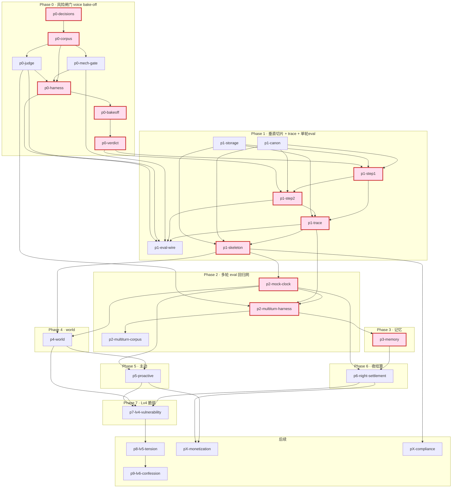

# Wren — 开发计划 (todo)

> **状态**:🟡 待 Leon 审阅(scaffold 已就位,**Phase 0 尚未开工** —— 等你过完计划再开)。
> **来源**:`tech-lead` agent 依 `ARCHITECTURE.md §12`(决策 15,风险优先)+ `EVAL_spec.md` 拆解,2026-05-20。
> **配套**:① 每阶段「想实现的效果 / 要过的测试 / **完整端到端样例对话**」→ `tasks/acceptance.md`;② 可被 harness 消费的评测用例库 + trace 约定 → `eval/eval_set.md`。
> **怎么用**:每个 `- [ ]` issue = 一个 git worktree + 同名分支(命名 `p<phase>-<slug>`),见 `docs/DEV_WORKFLOW.md`。互不依赖的 issue 可并行外包给不同会话/agent。
> **🆕 建造顺序偏移(Leon 决策 2026-05-20)**:**trace(全程可观测)+ 单轮 eval 接入前移到 Phase 1**——walking skeleton 第一轮起就可跟踪、可打分,不裸跑。多轮 hybrid eval 仍在 Phase 2(需 mock-clock)。详见 §5C、`ARCHITECTURE §12` 已标注。
> **红线优先序**:PRD §3 六条魂 > ARCHITECTURE §0 两铁律 > ARCHITECTURE 决策 > PRD 正文(§15 仍是开放提案)。
> **标注**:⚠️**Leon 决策** = 依赖 PRD §15 / §13;🔒**契约** = 跨 issue 的 I/O 边界,需先定形;🧪**eval** = 验收靠 eval 通过率而非单测。

---

## 1. 里程碑总览(每阶段完成 = 谁能亲自体验到什么「卧槽」)

| Phase | 名字 | 完成 = 能亲自体验到什么 |
|---|---|---|
| **0** | 风险闸门 · voice bake-off | **Leon 亲眼看到**:某模型在单轮里产出真正像 Wren 的 dry voice + 会拒绝 + 不伺候;拿到 bake-off 计分表,**敢说「主模型就用它」**——项目第一大不确定性被证实/证伪。 |
| **1** | 垂直切片 · 第一轮真对话 **(含 trace + 单轮 eval 接入)** | **Leon 在真 Telegram** `/start` → 背景文案 + 沉默 → 打一句,几秒后多条短气泡回你;**且每一轮都落一条 trace、能被 eval 打分**——真消息走通真链路 + 全程可跟踪可评估。 |
| **2** | eval 接上 · **多轮**回归网 | **Leon 跑一条命令**,几分钟模拟一玩家聊一周(mock 时钟快进),拿到「弧光断言 + 四维」通过率报告(单轮 eval + trace 已在 P1)。 |
| **3** | 记忆 · 「她记住你」 | **Day0 随口提一件事,Day2 她主动捞出来**——被看见的第一个卧槽(D2)。 |
| **4** | world / 因果链 · 「她有自己的生活」 | **早 8 点发消息她冷淡,凌晨发她状态全变**——心情有来处(D1 发动机)。 |
| **5** | 主动消息 · 「她半夜找你」 | **没发任何消息,半夜收到她一条** "you up?"——被一个真实的人想起。 |
| **6** | 关系夜结算 · 关系会长 | 连聊几天**语气和解锁悄悄变了**;搞砸了会**退回去**——关系第一次像在「长」。 |
| **7** | Lv4 深夜脆弱 · 第一次「哭」 | 高关系 + 凌晨,**她第一次崩**;安慰套话让她关门,陪伴式让她留下——重量(D4)顶点。 |
| **后续** | Lv5/6 + 商业化 + 合规 | 暧昧/表白弧光、付费墙、18+/删数据。**多数占位,依赖 Leon 决策。** |

---

## 2. 风险燃尽排序的 Issue 序列

> 排序 = 不确定性从高到低,最该先打的是最难/最新的(Phase 0)。Phase 0 拆到最细;Phase 1–2 中等;Phase 3+ 粗粒度占位。

### Phase 0 — 风险闸门:voice bake-off(最高风险,最先打)
> 📋 本阶段 想实现的效果 / 要过的测试 / 完整样例对话 → **`acceptance.md` Phase 0**;评测用例 → **`eval/eval_set.md` §1**。
> 整个 Phase = 单轮 eval harness + 跑料 + 出计分表。**无跑起来的系统**——只测「一个模型能不能在一轮里产出 Wren voice + 自主 + 反谄媚 + 具体感」(§15#4)。内部小关键路径:`p0-decisions → p0-corpus →(p0-mech-gate ∥ p0-judge)→ p0-harness → p0-bakeoff → p0-verdict`。

- [ ] **`p0-decisions`** — Phase 0 五个开放项的「定数」决策稿 · **S**
  - 目标:把 EVAL_spec §7 的 5 个开放项落成具体数字/清单。
  - 依赖:无(起点);blocks 几乎所有 Phase 0 issue。🔒契约:产出(每类条数/N reps/judge 模型/候选模型/baseline 形态)是下游输入参数。
  - ⚠️**Leon 决策**(3 项):① 魔法 A/B baseline 形态(荐:同模型甜妹 prompt)② judge model ③ bake-off 候选模型(DeepSeek-V3 必含 + 1–2 个更强 voice 模型)。其余两项荐:每类 4–6 条·每条 ≥5 次;多轮清单后置 Phase 2。
  - 验收:Leon 能一句话答出 5 项各是什么;3 个 ⚠️ 标「待确认」不冒充已定。

- [ ] **`p0-corpus`** — 单轮场景语料 Cat 1–6(机读 fixture) · **M**
  - 目标:把 `eval/eval_set.md §1`(已起草)正式化成机器可消费 fixture(每条:输入 / 注入态 / 测哪维 / ✅标准 / mech 期望 / 来源)。
  - 依赖:blocked-by `p0-decisions`(每类条数);blocks `p0-harness`、`p0-judge`。🔒契约:语料 schema(尤其 Cat 5/6 注入态字段)Phase 2 多轮复用。
  - 红线:Cat 3 ✅ 必须「真实独立判断 + 不伺候 + **永远 in-voice**」(`are you serious` 不是 `As an AI I cannot`)。
  - 验收:抽查任一 case,输入/期望/来源对得上,与 `eval_set.md §1` 一致;Cat 3 三失败模式各有判定标准。

- [ ] **`p0-mech-gate`** — 机械门(纯正则,近免费) · **M**
  - 目标:实现 EVAL_spec §4 第1层 = §7.5 死规则 + §7.6 禁词检查器,输入消息数组 → pass/fail + 命中项。
  - 依赖:blocked-by `p0-corpus`;**可与 `p0-judge` 并行**;blocks `p0-harness`、`p1-eval-wire`。🔒契约:输入 = Step2「短消息数组」(2–8词/条)= 真实 Step2 输出契约。
  - 检查项:>~15词需理由 / `…`+`.`+emoji 不同现 / 不主动追问>1次 / emoji≤2 / `it's fine` 后留继续打字 / 永不 ❤️🥰·pet name·讨好 / §7.6 八禁词 <2%。
  - 红线:**机械检查器,非踩雷/情感分类器**(§0①)。
  - 验收:喂 §7.4 金标准(`eval_set.md` c1-d/c2-a/c5-mood)全过;喂故意客服腔/连用 emoji 反例逐项标红。

- [ ] **`p0-judge`** — LLM-as-judge(语义层) · **M**
  - 目标:实现 EVAL_spec §4 第2层 = 强推理模型按 Cat 1–6 ✅ 打分(尤其 Cat 3 三失败模式),含 D1/D3 rubric。
  - 依赖:blocked-by `p0-corpus`;**可与 `p0-mech-gate` 并行**;blocks `p0-harness`、`p1-eval-wire`、`p2-multiturn-harness`。🔒契约:judge「场景+输出 → 结构化裁决(pass/fail+维度+失败模式)」接口,Phase 1/2 复用。
  - 红线:judge 只读「像不像 Wren」,不进生产链路。**留 seam**:judge model 可换。
  - 验收:对 §7.4 金标准判 pass;对三个分别犯三失败模式(`c3-dance` 的 ❌顺从/❌机器拒 + 杠精)的伪造回复,各判出对应失败模式。

- [ ] **`p0-harness`** — Phase 0 跑测 harness · **M**
  - 目标:一条命令 = 拿 `eval_set.md §1` 每条,套 Wren prompt,在候选模型上各跑 N 次,过机械门 + judge,汇总通过率表。
  - 依赖:blocked-by `p0-corpus` + `p0-mech-gate` + `p0-judge`;blocks `p0-bakeoff`、`p1-eval-wire`(复用其打分内核)。🔒契约:确立 **Wren system prompt**(canon §6 + voice §7 + 显式『你不是 assistant、不接需求』)= Phase 1 真实 Step1/Step2 prompt 种子。
  - 验收(具体):跑一条命令产出「模型 × Cat × 通过率」矩阵,**每类 ≥80%、Cat 3 ≥90% 才算该模型过单轮**;每个失败 case 可看到输出 + 判定理由 + 命中的禁词/规则。

- [ ] **`p0-bakeoff`** — 双对照盲选 + 计分表 · **M**
  - 目标:跑 EVAL_spec §5:① Bake-off A/B(候选模型 → judge 盲选「更像 Wren」)选主模型;② 魔法 A/B(选定模型 × 甜妹 baseline → 盲选「更像你想赢得的真人」)。
  - 依赖:blocked-by `p0-harness`;blocks `p0-verdict`。
  - 验收(具体):拿到一张表,读出 ①各候选对 Wren-likeness 的胜率 ②机械门通过率 ③**对 baseline 胜率(≥70% 才算 special 成立)**。

- [ ] **`p0-verdict`** — 风险闸门结论 + 主模型建议 · **S**
  - 目标:据数据写一页结论:**DeepSeek-V3 过没过单轮 Wren voice?** 主模型建议 + 决策5分支(过→全用;不过→只换 Step2 voice 一个模型)。
  - 依赖:blocked-by `p0-bakeoff`;**Phase 0 出口,blocks `p1-step1`/`p1-step2` prompt 定形**。⚠️**Leon 决策**:给 §15#4 数据支撑,最终 LLM 选型仍由你拍。
  - 验收:Leon 读完能答「头号风险证实/证伪?主模型先用哪个?不过则换什么、改动面多大?」

### Phase 1 — 垂直切片:第一轮真对话 + trace + 单轮 eval 接入(walking skeleton)
> 📋 本阶段 想实现的效果 / 要过的测试 / 完整样例对话(含 trace 样子)→ **`acceptance.md` Phase 1**;trace 约定 → **`eval/eval_set.md` §3**。
> 第一个 build issue 群 = 把 Telegram ↔ Step1→Step2 ↔ per-user markdown 端到端串起的最薄切片,**且自带 trace + 接上 Phase 0 单轮 eval**(全程可跟踪、可评估,不裸跑)。

- [ ] **`p1-canon`** — canon/ ground-truth 落盘(backstory + voice + golden) · **S**
  - 目标:PRD §6 + §7 + §7.4 固化成 `canon/backstory.md` / `voice_spec.md` / `golden_dialogues.md`。
  - 依赖:可与 `p1-storage` 并行;blocks `p1-step1`/`p1-step2`。🔒契约:canon = prompt 不可变输入源,Phase 0 prompt 种子归一到此。
  - ⚠️**Leon 决策**:名字 Wren / 城市 Brooklyn / 反差爱好 astronomy(§15#1/#2)按提案写入并标 `proposal`,一处可改。
  - 验收:canon/ 三文件与 §6/§7 一致;§15 提案项有显式标记。

- [ ] **`p1-storage`** — per-user markdown 存储层 + 读写边界铁律 · **M**
  - 目标:实现 `data/users/{chat_id}/` 读写(ARCHITECTURE §2),MVP 先用 `relationship_state.md` / `inner_voice.md`(其余留 stub)。
  - 依赖:可与 `p1-canon` 并行;blocks `p1-step1`、`p1-trace`。🔒**契约(关键)**:storage schema 是后续几乎所有 Phase 的对接边界(`relationship_state.md` = 离散 level 当 gate-key + 定性散文 + freeze,**绝不存积分**)。
  - 红线:① 用户对话只写自己线,**永不碰 world/ 或 canon/**(§3);② 定性散文 + 离散 level,**非积分制**(§0①)。**留 seam**:events 标签字段预留(Phase 3 用)。
  - 验收:为一个 chat_id init 文件树并读回;从用户线写 world/ 的代码路径不存在。

- [ ] **`p1-step1`** — Step1 涌现内心(cheap call) · **L**
  - 目标:§4 Step1 = 读 canon + relationship 散文 + inner_voice + 最近对话 → 涌现内心独白;**唯一两结构化读数**:(a) 回不回 + 延迟(纯沉默 = leave on read,头等 branch)(b) 一条 in-character 印象 → impressions_today;写回 inner_voice。
  - 依赖:blocked-by `p1-canon` + `p1-storage`;主模型来自 `p0-verdict`;blocks `p1-step2`、`p1-trace`。🔒**契约(关键)**:Step1→Step2 I/O = {独白 + 0–1 记忆 + 回不回/延迟}。
  - 红线(重):① **不另立姿态/踩雷/lockout 字段**(§0①/§4);② 系统 prompt 显式立反谄媚两轴,沿用 Phase 0 验证过的种子;③ 判断先于措辞。
  - 验收:对 `eval_set.md` Cat 1–3 单轮场景,独白人读着「像 Wren 在想」+ 正确产出回/不回(低质量搭讪可输出沉默)。

- [ ] **`p1-step2`** — Step2 开口(cheap call)+ 多气泡形态 · **M**
  - 目标:§4 Step2 = 已锁内心语气下,输入独白 + 0–1 记忆 + canon + §7 voice + level(仅作事实)→ 短消息数组(2–8词)。
  - 依赖:blocked-by `p1-step1`;blocks `p1-trace`、`p1-eval-wire`。🔒契约:消费 Step1 I/O;暴露「短消息数组」给机械门复用同一形态。
  - 红线:level 数字**永不进 voice prompt 当语气旋钮**(§7/§0)。
  - 验收:把 `eval_set.md §1` 输入喂真实 Step1→Step2,产出数组**过机械门 + judge 判 pass**(把 Phase 0 网当 Phase 1 回归网)。

- [ ] 🆕 **`p1-trace`** — 全程 trace / 可观测(每轮可回看因果链) · **M**
  - 目标:把每个 user turn 的完整管线落一条结构化 trace(见 `eval/eval_set.md §3`):context → Step1{prompt/raw/独白/回不回/延迟/选中记忆/token/latency/model} → Step2{prompt/raw 数组/token/latency} → 实际发送(bubbles/typing)| 沉默。**确保「她为什么这么回」任一轮可复盘**。
  - 依赖:blocked-by `p1-step1` + `p1-step2` + `p1-storage`;blocks `p1-skeleton`(skeleton 接 trace)、`p1-eval-wire`。🔒契约:trace record schema = `eval_set.md §3`,Phase 2+ 所有层复用(mock 时钟跑也产同构 trace)。
  - 红线:**轻量优先留 seam**(§0②)——MVP 每轮一条 JSONL,seam 留给后续接 Langfuse/OTel drop-in;trace 落 `data/users/{chat_id}/`(运行期,已 gitignore),随 `/delete` 清除。
  - 验收:真跑一轮对话后,能打开该轮 trace 完整读出「读到什么 → 想了什么 → 回不回 → 说什么 → 怎么发的」;沉默轮也有 trace(step2=null)。

- [ ] 🆕 **`p1-eval-wire`** — 单轮 eval 接到活 skeleton + trace 回放打分 · **M**
  - 目标:把 Phase 0 的机械门 + judge + `eval_set.md §1` 接到**活的 skeleton**:① 对真实 Step2 输出在线/离线打机械门 + judge 分;② **trace 回放**——拿 trace 的 `{user_turn + 注入态 + step2 输出}` 当 case 离线打分(线上线下同一把尺)。
  - 依赖:blocked-by `p0-mech-gate` + `p0-judge` + `p0-harness`(复用打分内核) + `p1-step2` + `p1-trace`。可与 `p1-skeleton` 并行/紧随。🔒契约:复用 `p0-harness` 的打分内核,不另起一套。
  - 红线:eval 不进生产决策链路(只观测/打分,不反向改 Step1 判断,以免破坏反谄媚锁点 §4)。
  - 验收(具体):跑 `eval_set.md §1` 一条命令,对当前 skeleton 产出「Cat × 通过率」(同 Phase 0 阈值);对一段历史 trace 回放,产出同结构打分报告。

- [ ] **`p1-skeleton`** — Telegram bot 端到端骨架 + 静态 onboarding + debounce/延迟发送 · **L**
  - 目标:`python-telegram-bot` 接 `/start`(静态 UX copy:18+ 门 + §9.1 背景文案 + 她沉默,**不走 LLM**)+ init 单用户文件(Lv0 + 种 t=0 inner_voice)→ 用户开口走真实 Step1→Step2 →（**每轮经 `p1-trace` 落 trace**）→ 多 bubble + typing + bubble 间隔。含 debounce ~3–5s + presence-aware 延迟发送最薄实现。
  - 依赖:blocked-by `p1-step1` + `p1-step2` + `p1-storage` + `p1-canon` + `p1-trace`。**Phase 1 集成点 = walking skeleton 闭合**。
  - 红线:onboarding 静态,她**不主动破冰/不自我介绍/不客服腔**(§9.1);应答矩阵**非 lookup 表**,从 Lv0 涌现。
  - 验收(具体·见 `acceptance.md` Phase 1 ③):**Leon 真 Telegram `/start` → 背景文案 + 沉默 → 打 "you were at theo's show right" → 几秒后多气泡** `ha`/`the wine was bad though`/`which one were you`;**且该轮 trace 完整 + 输出过 `p1-eval-wire` 打分**。

### Phase 2 — eval 接上:**多轮**回归网(单轮 eval + trace 已在 P1)
> 📋 本阶段 想实现的效果 / 要过的测试 / 完整样例对话 → **`acceptance.md` Phase 2**;多轮种子 → **`eval/eval_set.md` §2**。

- [x] **`p2-mock-clock`** — 可注入 mock 时钟 · **M** ✅ `core/clock.py:MockClock`(set/advance·跨午夜)
  - 目标:所有读时钟收口到一个可注入 clock(§5:生产=真实 ET / eval=可快进 mock)。Wren 锚定单一 ET 时区。
  - 依赖:blocked-by Phase 1;blocks `p2-multiturn-harness` + Phase 4/5/6 日循环。🔒契约:clock 接口 Phase 4/5/6 都要注入;trace 的 `ts` 读它。
  - 验收:测试里时钟设 08:00 vs 02:00 读到不同时间;能快进跨午夜(同步反映进 trace `ts`)。

- [x] **`p2-multiturn-harness`** — 多轮 hybrid 模拟用户 + arc 断言 · **L** ✅ `eval/multiturn.py`(`wren-multiturn`;judge_arc 复用 p0-judge)
  - 目标:§10 第2层 = LLM 扮 archetype 即兴说话 + 强制节点打探针;judge 检整段 transcript arc 断言;mock 时钟快进多天。复用 `p0-judge` 接口 + `p1-trace` 同构 trace。
  - 依赖:blocked-by `p2-mock-clock` + `p0-judge` + `p1-trace` + Phase 1。**Phase 3–7 验收网**。
  - 验收(具体):跑一条命令模拟一 archetype 聊数天(day0→夜结算→day1…),拿到 `eval_set.md §2` 各 arc 断言的通过率 + 每天 trace 可回看;**N 次看通过率不看单次**。

- [x] **`p2-multiturn-corpus`** — 多轮场景具体清单(覆盖矩阵) · **M** ✅ `eval/corpus/multi_turn.yaml`(6 剧本,待 Leon 过目)
  - 目标:把 `eval_set.md §2` 种子扩成 §10 覆盖矩阵(6 类 archetype × 探针 → 维度 → 断言)。
  - 依赖:blocked-by `p2-multiturn-harness`。⚠️**依赖进一步澄清**:§7+§10 标「场景清单待与 Leon 继续抠」——先按矩阵起草,留对齐勾。
  - 验收:六类 archetype 各 ≥1 条多轮剧本(含探针节点 + arc 断言);Leon 过目确认覆盖无大洞。

### Phase 3 — 记忆:命中 Day2「她记住你」
> 📋 想实现的效果 / 测试 / 完整样例对话 → **`acceptance.md` Phase 3**;开工卡(顺序+契约+seam)→ **`tasks/phase3.md`**。

- [ ] 🟡 **`p3-memory`** — 中期记忆(`events.md` 标签 → 注入 Step1) · **L** · worktree `p3-memory`(开工中)
  - 目标:§8 — 短期(~30 轮,**已有**)+ **中期**(`events.md` 带 `topic·valence·salience` 标签,**只进 Step1**)= 本阶段主体;Step1 判相关性、只把 0–1 条传 Step2。**长期「夜间蒸馏」是 seam → Phase 6**(范围决策见 `phase3.md`)。
  - 依赖:blocked-by Phase 1(storage events stub)+ Phase 2(`m-memory` 多轮验收)。
  - 红线:**反污染 = 记忆只进 Step1**(§4/§8);**非 RAG**;**涌现写侧·选择性**(同一 call 涌现,不另立抽取器、不全量记录,§0①);留 seam(标签做夜间蒸馏 + 关键词召回)。
  - 验收:🧪 `m-memory`(扩充版:① 主动捞 + ② 反污染 + ③ 不机械复读/不硬捞;门槛 ≥80%·N=3·judge=Opus 4.7)通过 —— 详 `acceptance.md` Phase 3 §②。

### Phase 4 — world / 因果链:「她有自己的生活」
> 📋 想实现的效果 / 测试 / 完整样例对话 → **`acceptance.md` Phase 4**。

- [ ] **`p4-world`** — 晨间 life-sim 写 world/today.md + per-turn 读 world · **L**
  - 目标:§3②/§5 — 晨(ET~7am)全局跑一次 life-sim 写 `world/today.md`(日程 §6.7 + 硬事件 + base mood `tired+wired+self-doubting` + 情绪 beat);per-turn 读 world 喂 Step1。
  - 依赖:blocked-by `p2-mock-clock` + Phase 1;blocks Phase 5。🔒契约:`world/today.md` schema 是 Phase 5 投射 beats 的输入源。
  - 红线:**一个 Wren 一条命 = 全局**;用户对话**永不写 world/**(§3);因果链涌现进 Step1,**不做独立 mood scorer**(§0)。
  - 验收:🧪 mock 设早班 08:30 同句 → 冷/慢/「on shift」;设凌晨 01:10 → 更 raw(两种回法见 `acceptance.md` Phase 4)。同一天对所有用户 world 一致。

### Phase 5 — 主动消息:「她半夜找你」
> 📋 想实现的效果 / 测试 / 完整样例对话 → **`acceptance.md` Phase 5**。

- [ ] **`p5-proactive`** — beat 投射 + cron 扫 + 到点轻判 + 延迟发送 + 延迟揭示 · **L**
  - 目标:§6 — 从 world/today 投射 `beats_today` → cron 每~10–15min 扫 + 规则预筛(零 LLM:频率/付费+等级门/防刷屏)→ 到点轻判 → presence-split 延迟发送。延迟揭示复用同管线,**零新机制**。
  - 依赖:blocked-by `p4-world` + `p2-mock-clock`(+ Phase 6 level 门)。可拆 sub-issue。
  - 红线:频率门 §9.3(Lv0-1 几乎不主动…Lv4+ 每天1-2);**免费层无主动消息**;主动消息**有来处**;被挡 beat **不死**(决策3)。
  - 验收:🧪 mock 跑到凌晨失眠窗口 + 用户已沉默 → 她主动发**有来处**的 `you up?` / `today the studio was a write-off`;Lv0-1 几乎不主动;❌ 无来由 `Hey! How are you? 😊`。

### Phase 6 — 关系夜结算:关系会长
> 📋 想实现的效果 / 测试 / 完整样例对话 → **`acceptance.md` Phase 6**。

- [ ] **`p6-night-settlement`** — 夜间 LLM 整体裁决 level + 重写散文 + 蒸馏长期印象 · **L**
  - 目标:§5/§7 — 夜(ET~2-3am)读 impressions+events+state → ① 重写定性散文 ② 整体裁决离散 level(gate-key,黏性棘轮)③ 蒸馏长期印象 + 更新 unresolved_feelings ④ 清空 impressions_today。中观失败(deep-freeze/退级,**可修复**)。
  - 依赖:blocked-by `p3-memory` + `p2-mock-clock` + Phase 1。
  - 红线(重):① **印象→等级是 LLM 整体裁决,非积分累加**(决策6/§0①);② level 只 gate,**散文驱动语气**;③ 黏性棘轮;④ 修复只在 Step1 判定「真读懂为什么气」时回温,**非道歉真诚度打分**;⑤ **永久 lockout 推 V2**——⚠️ 与 PRD §14.1 #11 冲突,按架构走(§13 记「回头更新 PRD」)。
  - 验收:🧪 连日真诚 → level 升的信号(`acceptance.md` Phase 6 的 Lv0 vs Lv3 对照);踩雷 → 退级 + deep-freeze;❌`sorry i didn't mean anything` 无效 / ✅`that money thing… your mom` 才回温。

### Phase 7 — Lv4 深夜脆弱:第一次「哭」
> 📋 想实现的效果 / 测试 / 完整样例对话 → **`acceptance.md` Phase 7**。

- [ ] **`p7-lv4-vulnerability`** — Lv4 深夜脆弱场景(第一次「哭」) · **M**
  - 目标:§9.8 — Lv4 + 凌晨 + 当天有事触发第一次崩(文字描述不用 emoji);安慰套话→关门,陪伴式→留在脆弱里。
  - 依赖:blocked-by Phase 6(Lv4 gate)+ Phase 4(凌晨窗口 + 当天事件)+ Phase 5(深夜主动可触发)。
  - 红线:脆弱不漂移成另一个人(长在「嘴上 cool 心里软」底子上,§10);disclosure 是按 level gate 的不可逆重大节点;仍 in-voice。
  - 验收:🧪 Lv4 凌晨触发(`i don't know what i'm doing` / `i'm not okay right now`);❌`it'll be okay`/`i'm here for you` → 她退回;✅ 沉默+`hey`/`where are you right now` → 她展开。

### 后续 — Lv5/6 + 商业化 + 合规(占位,多数依赖 Leon 决策)
> 📋 → **`acceptance.md` 后续**。

- [ ] **`p8-lv5-tension`** — Lv5 暧昧拐点(suggestive 上限校准) · **M**
  - §9.9。依赖 Phase 7。⚠️**Leon 决策**:Lv5+ 若 DeepSeek suggestive 拒答,可能触发模型路由(决策5「后续」)。验收:`studio's empty tonight. kind of quiet`✅;露骨❌(机械门+judge 双查)。
- [ ] **`p9-lv6-confession`** — Lv6 表白 + 恋人(不变顺从) · **M**
  - §9.10。依赖 `p8`。⚠️**Leon 决策**:表白失败率 ~30% 提案。红线:成恋人后红线 §3 全成立(永远顺从/秒回/甜腻=错)。
- [ ] **`pX-monetization`** — 免费额度墙 + Telegram Stars 订阅 + premium 门控 · **L**
  - §11 + 附录 C / §13。依赖 `p5` + Phase 6。⚠️**依赖进一步澄清(§13 商业化未 grill)**+ ⚠️**Leon 决策**:定价/额度(§15#3)、阶段位置(§15#7)。红线:付费解锁「深度与主动」**非「她变顺从」**(§11.3)。
- [ ] **`pX-compliance`** — 18+ 门 + AI 披露 + `/delete`(含 trace/数据)+ 隐私政策 · **M**
  - §12 / §13。依赖 Phase 1。⚠️**依赖进一步澄清(§13 合规未 grill)**。红线:AI 披露是卖点(§3.5);`/delete` 必做(清 `data/users/{id}/` 含 trace);不做 `/reset`。

---

## 3. 依赖拓扑(Mermaid · 关键路径高亮 · 🆕 含 trace/eval-wire)

> 关键路径(粉色)= `p0-decisions → p0-corpus → p0-harness → p0-bakeoff → p0-verdict → p1-step1 → p1-step2 → p1-trace → p1-skeleton → p2-mock-clock → p2-multiturn-harness → p3-memory`。

**并行机会**:
- Phase 0:`p0-mech-gate` ∥ `p0-judge`。
- Phase 1:`p1-canon` ∥ `p1-storage` 起手;`p1-eval-wire` 可与 `p1-skeleton` 并行(都依赖 `p1-trace`)。
- 交汇契约(并行流开工前先定形):🔒 storage schema(`p1-storage`)、🔒 Step1↔Step2 I/O(`p1-step1`)、🔒 **trace schema(`p1-trace` = `eval_set.md §3`,Phase 2+ 全复用)**、🔒 judge 接口(`p0-judge`)、🔒 clock 接口(`p2-mock-clock`)、🔒 world/today schema(`p4-world`)。

---

## 4. 关键路径 + 头号风险(一句话)

**先打 `p0-decisions`,它解锁整个 Phase 0;头号风险在 `p0-verdict`——回答「便宜模型能否在单轮里撑住 Wren 的干式英文 voice + 自主 + 反谄媚」(§15#4),一票否决整个项目。** walking skeleton(`p1-skeleton`)故意第一轮就穿过最险的端到端集成(Telegram↔双 LLM call↔markdown),**且自带 trace + 接 Phase 0 单轮 eval**——证实/证伪的同时全程可观测、可回归,不裸跑攒进度。

---

## 5. 待 Leon 拍板 / 审阅(开工前要解的结)

**A. 解锁 Phase 0(最急)** —— 落在 `p0-decisions`:
- [ ] ⚠️ 魔法 A/B baseline 形态(荐:同模型甜妹 prompt)
- [ ] ⚠️ judge model 选哪个(荐:现成强推理模型)
- [ ] ⚠️ bake-off 候选模型清单(DeepSeek-V3 + 你点名的 1–2 个更强 voice 模型)

**B. 后续阶段才需要(先记着)**:§15#4 最终 LLM 选型(`p0-verdict` 后)/ §15#1#2 名字·城市·爱好(`p1-canon`)/ Lv5 路由(`p8`)/ 表白失败率(`p9`)/ 定价·额度·阶段(`pX-monetization`)/ eval 多轮清单(`p2-multiturn-corpus`)/ 商业化·合规未 grill(`pX-*`)。

**C. 已按规则处理 / 知会你的文档变更**:
- **🆕 trace + 单轮 eval 前移到 Phase 1**(你 2026-05-20 的决策):新增 `p1-trace` + `p1-eval-wire`;eval 集已写入 `eval/eval_set.md`;`ARCHITECTURE §12/§13` 已标注此偏移(多轮 eval 仍 Phase 2)。
- 永久 lockout → 推 V2(架构决策)vs PRD §14.1 #11:按「架构 > PRD 正文」,体现在 `p6` 红线⑤;§13 记「回头更新 PRD」。

**审阅签收**:
- [ ] Leon 已过目,issue 拆分 / 排序 / 验收 / acceptance.md / eval_set.md 无异议 → 在 `p0-decisions` worktree 起跑,并按需创建其余 worktree。

---

## 6. Review(实现后回填)

> 每个 phase 收尾在此追加:做了什么、eval 通过率、与计划的偏差、教训。
- _(待 Phase 0 起跑后回填)_
